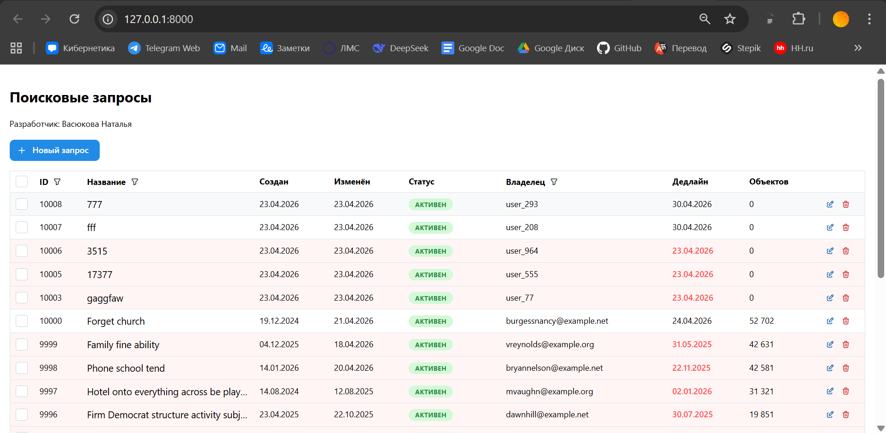
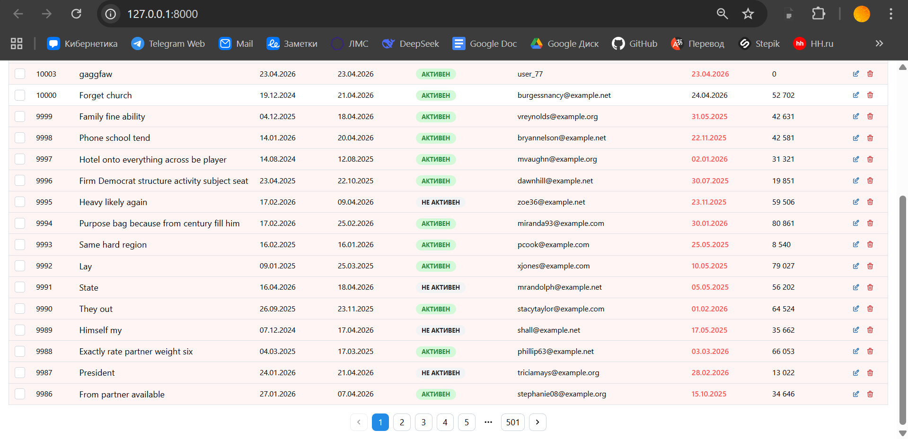
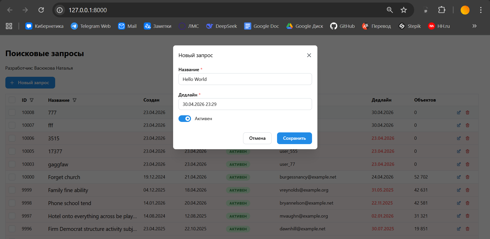
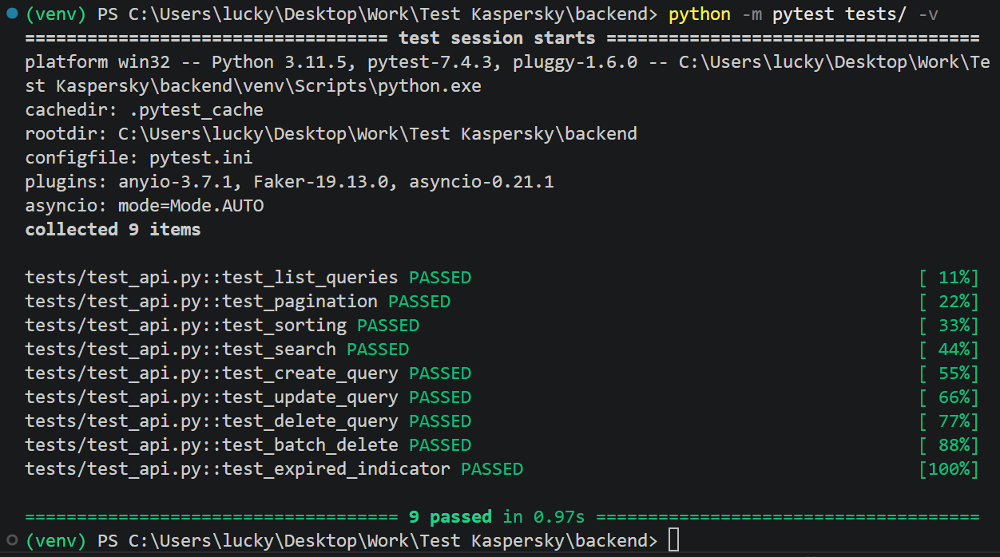

# Search Query Manager

Веб-приложение для управления поисковыми запросами. 

## Стек

- **Backend:** Python, FastAPI, SQLAlchemy, SQLite, Pytest
- **Frontend:** React, TypeScript, Mantine UI, Vitest

## Функционал
- Отображение таблицы поисковых запросов с пагинацией (20 записей на странице)
- Серверная сортировка по всем столбцам
- Серверный поиск по названию
- Создание, редактирование и удаление запросов
- Групповое удаление выбранных записей
- Подсветка истёкших дедлайнов красным
- 10 000+ предсгенерированных записей в базе

## Скриншоты

**Таблица с поисковыми запросами**


**Пагинация**


**Создание нового запроса**


**Тесты бэкенда**


## Запуск продакшен-сборки (единый сервис)
```
cd backend
uvicorn app.main:app --host 0.0.0.0 --port 8000
```
Открыть: http://localhost:8000

## Запуск (режим разработки)
Запуск в 2-х терминалах.  
Backend (терминал 1):
```
cd backend
pip install -r requirements.txt
python -m app.seed    # генерация 10 000 записей, запускать 1 раз
uvicorn app.main:app --reload
```
API будет доступен на http://localhost:8000, документация на http://localhost:8000/docs

Frontend (терминал 2):
```
cd frontend
npm install
npm run dev
```
Интерфейс доступен по адресу: http://localhost:3000

## Тесты (backend)
```
cd backend
python -m pytest tests/ -v
```

## Структура проекта
```
search-query-manager/
├── backend/
│ ├── app/
│ │ ├── main.py # эндпоинты
│ │ ├── database.py # подключение к БД
│ │ ├── models.py # SQLAlchemy-модели
│ │ ├── schemas.py # Pydantic-схемы
│ │ ├── crud.py # операции с БД
│ │ └── seed.py # генерация 10 000+ записей
│ ├── tests/
│ │ ├── conftest.py # фикстуры
│ │ └── test_api.py # тесты API
│ ├── static/ # собранный фронтенд
│ ├── requirements.txt
│ └── pytest.ini
├── frontend/
│ ├── src/
│ │ ├── api/
│ │ │ └── queries.ts # HTTP-запросы к API
│ │ ├── components/
│ │ │ ├── QueryTable.tsx
│ │ │ └── QueryForm.tsx
│ │ ├── types.ts
│ │ ├── App.tsx
│ │ └── main.tsx
│ ├── package.json
│ └── vite.config.ts
├── .gitignore
└── README.md
```
